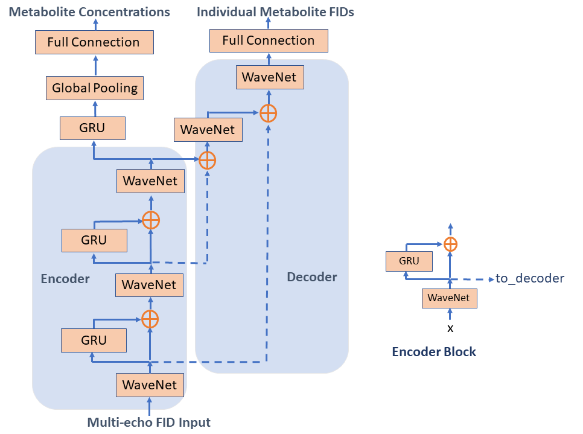

Model architecture for direct prediction of metabolite concentrations with spatially localized magnetic resonance spectroscopy JPRESS. The inputs are time domain 32-echo free induction decay (FIDs) with the data format (N, E, S, C) for batch size (16), number of echoes (32), data points (2048), and channels (2), respectively. The encoder comprised three WaveNet blocks which created individual echo feature maps and representations (after pooling over the 2048 points) in three different levels. The output was split into two branches: the unified representation for metabolite concentrations on the left and individual metabolite FIDs on the right. In addition to the metabolite concentrations, the unified representation also output spectral phase and frequency offset. The recurrent GRU units fused the feature representations from different echoes and concatenated the outputs with the previous features to create new higher level feature maps. ⊕ stands for the concatenation operation. Reconstruction of FID signals of individual metabolites was accomplished using the two WaveNet blocks on the right of the architecture that decoded the three-level feature maps.
