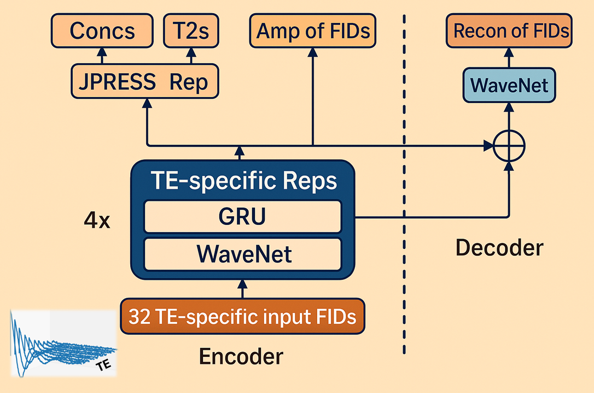

The outline of the deepJPRESS model architecture. TE-specific representations are generated by a combined use of WaveNet and GRU before being aggregated to create the JPRESS representation. This representation serves as the output of the encoder and maps the input FIDs to metabolite concentrations and T2s. The WaveNet block is a convolutional network that extracts metabolite spectral features. It uses dilated convolutions, rather than strides, to capture long-range dependencies while keeping the input size unchanged. This structure was adopted because the TE-specific representations needed to be iteratively processed to fuse spectral features of individual spectra through the GRU block. An auxiliary output is included to forecast the amplitudes of individual FIDs, facilitating learning the JPRESS representation. The decoder utilizes outputs from multiple encoder layers to reconstruct target component FIDs. 

Reference:
Zhang Y, Shen J. Quantification of spatially localized MRS by a novel deep learning approach without spectral fitting. Magn Reson Med. 2023;1‐15. doi: 10.1002/mrm.29711
